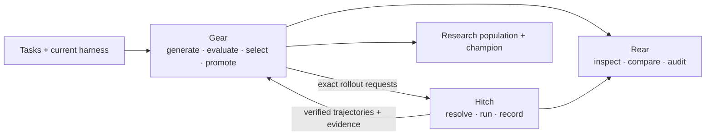

# GEAR

### General Evolution ARchitecture

**Open infrastructure for AI agents that learn from real-world experience.**

[Website](https://rsigear.xyz) · [Discord](https://discord.gg/cZ4NBbHDk)

GEAR is an open architecture for continuous agent evolution. We are building
the infrastructure to version agent harnesses, run reproducible evaluations,
turn trajectories and feedback into optimization signals, and inspect every
decision from experiment to deployment.

Our current focus is harness evolution: test exact revisions under controlled
conditions, preserve the evidence behind every result, and promote only the
changes that earn it.

## The stack

| Project | Layer | What it does |
| --- | --- | --- |
| [**Gear**](https://github.com/rsi-gear/gear) | Evolution algorithms | Generates candidate harness revisions, evaluates them under paired conditions, selects a research population, and promotes a deployment champion. |
| [**Hitch**](https://github.com/rsi-gear/agent-hitch) | Versioned execution & evaluation | Runs Codex, Claude Code, Pi, OpenCode, and DeepSeek Harness from exact versions or commits, preserving artifacts, trajectories, logs, and evaluation evidence. |
| [**Rear**](https://github.com/rsi-gear/rear) | Experiment analysis | Provides a read-only workbench for exploring Gear experiments, comparing candidates, and inspecting verified Hitch trajectories. |

## How it fits together

The responsibilities stay deliberately separate: Gear owns experiment state
and refinement decisions, Hitch is the source of truth for execution evidence,
and Rear never mutates either system.

## Start here

- Want reproducible agent runs and evals? Start with [Hitch](https://github.com/rsi-gear/agent-hitch#readme).
- Want to evolve an agent harness from evaluation feedback? Start with [Gear](https://github.com/rsi-gear/gear#readme).
- Want to inspect experiments and compare their evidence? Explore [Rear](https://github.com/rsi-gear/rear#readme).

> [!NOTE]
> These projects are early-stage and under active development. APIs, extension
> points, and persisted state formats may change between releases.

## Community

We welcome researchers and builders working on agent harnesses, evaluations,
coding-agent infrastructure, and continuous learning systems. Join the
[GEAR Discord](https://discord.gg/cZ4NBbHDk) to follow development and share
what you are building.
